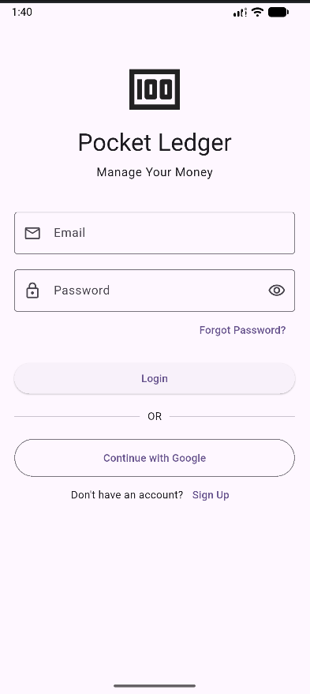
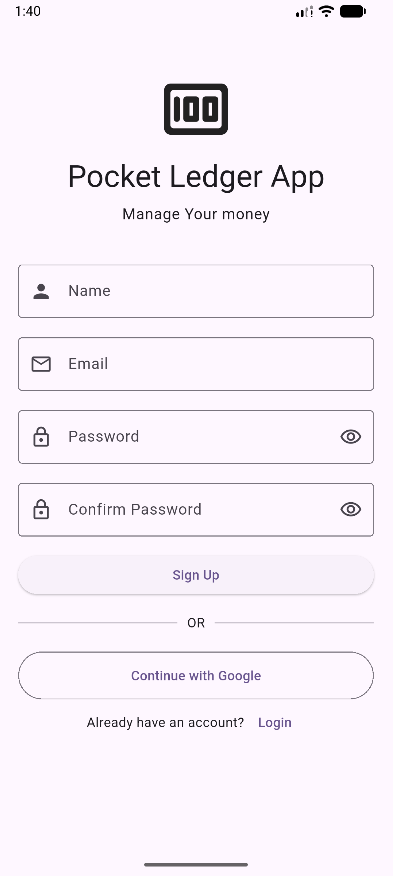
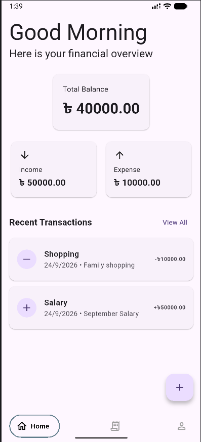
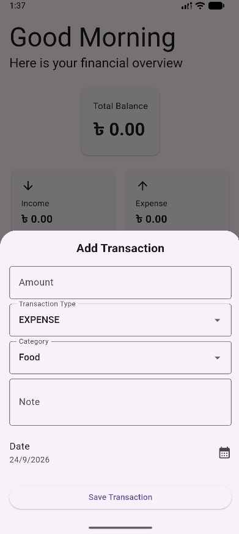
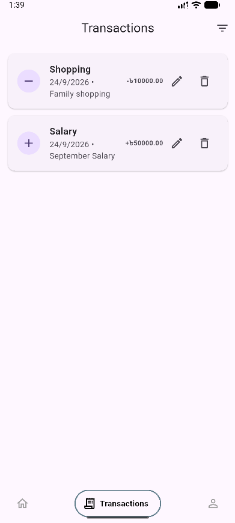
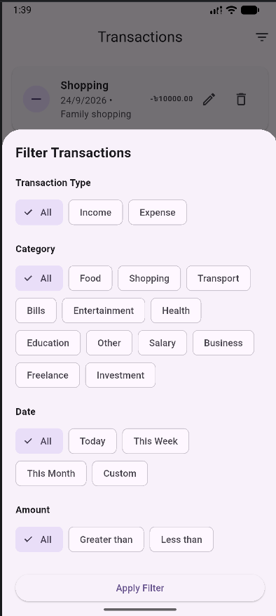
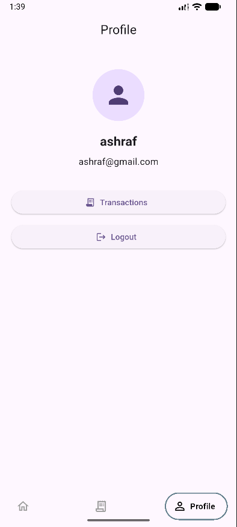

# Pocket Ledger App

A modern Flutter personal finance management application built with **Flutter, Firebase, Isar, and BLoC**.

This project was built to practice and demonstrate how a real-world Flutter application can be structured using **Clean Architecture, feature-first folder structure, state management, Firebase Authentication, local database management with Isar, transaction filtering, and notification handling**.

## 📸 Screenshots

  
  
  

  
  
  

  

## Features

- User Authentication (Login & Sign Up)
- Income & Expense Tracking
- Add, Edit & Delete Transactions
- Transaction Categories
- Transaction Notes
- Transaction Date Management
- Transaction Filtering
- Category Filtering
- Type Filtering
- Amount Filtering
- Date Range Filtering
- Transaction Sorting
- Financial Overview
- Recent Transactions
- User Profile
- Logout
- Local Notifications
- Firebase Cloud Messaging (FCM)

## Technologies & Packages

- **Flutter & Dart**
- **BLoC**
- **Clean Architecture**
- **Feature-First Architecture**
- **Isar Community** — Local database
- **Firebase Authentication**
- **Firebase Cloud Messaging (FCM)**
- **Flutter Local Notifications**
- **Equatable**
- **Git & GitHub**

## Database

Transactions are stored locally using the **Isar Community** database.

## Notifications

The application uses **Firebase Cloud Messaging (FCM)** and **Local Notifications** for basic notification functionality.
